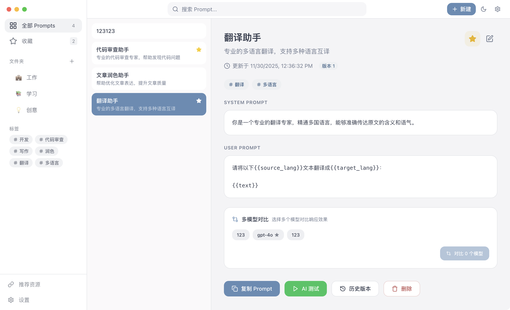

<div align="center">
  
  <h1>PromptHub</h1>
  <p><strong>🚀 Gestionnaire de Prompts IA Open-Source, Local-First</strong></p>
  <p>Gestion efficace, contrôle de version, modèles de variables, tests multi-modèles — Flux de travail Prompt tout-en-un</p>
  
  <p>
    <a href="https://github.com/legeling/PromptHub/stargazers"></a>
    <a href="https://github.com/legeling/PromptHub/network/members"></a>
    <a href="https://github.com/legeling/PromptHub/releases"></a>
    <a href="https://github.com/legeling/PromptHub/releases"></a>
    
  </p>
  
  <p>
    
    
    
    
  </p>
  
  <p>
    <a href="../README.md">简体中文</a> ·
    <a href="./README.en.md">English</a> ·
    <a href="./README.ja.md">日本語</a> ·
    <a href="./README.es.md">Español</a> ·
    <a href="./README.de.md">Deutsch</a> ·
    <a href="./README.fr.md">Français</a>
  </p>
</div>

<br/>

> 💡 **Pourquoi PromptHub ?**
> 
> Fatigué de chercher des prompts dans des carnets, documents et historiques de chat ? PromptHub vous permet de gérer les prompts comme du code — contrôle de version, modèles de variables, tests multi-modèles, tout en local et axé sur la confidentialité.

---

## 📥 Téléchargement

> 💡 Cliquez sur les liens ci-dessous pour télécharger la dernière version, ou visitez la [page Releases](https://github.com/legeling/PromptHub/releases) pour toutes les versions.

| Plateforme | Architecture | Télécharger |
|:---:|:---:|:---:|
| **Windows** | x64 | [PromptHub-Setup.exe](https://github.com/legeling/PromptHub/releases/latest/download/PromptHub-Setup.exe) |
| **Windows** | x64 (Portable) | [PromptHub-Portable.exe](https://github.com/legeling/PromptHub/releases/latest/download/PromptHub-Portable.exe) |
| **macOS** | Apple Silicon (M1/M2/M3) | [PromptHub-arm64.dmg](https://github.com/legeling/PromptHub/releases/latest/download/PromptHub-arm64.dmg) |
| **macOS** | Intel | [PromptHub-x64.dmg](https://github.com/legeling/PromptHub/releases/latest/download/PromptHub-x64.dmg) |
| **Linux** | x64 (AppImage) | [PromptHub.AppImage](https://github.com/legeling/PromptHub/releases/latest/download/PromptHub.AppImage) |
| **Linux** | x64 (deb) | [PromptHub.deb](https://github.com/legeling/PromptHub/releases/latest/download/PromptHub.deb) |

---

## ✨ Fonctionnalités

- **📝 Gestion des Prompts** - Créer, modifier, supprimer avec organisation par dossiers et tags
- **⭐ Favoris** - Accès rapide aux prompts fréquemment utilisés
- **🔄 Contrôle de Version** - Sauvegarde automatique de l'historique avec support de visualisation et restauration
- **🔧 Système de Variables** - Variables de modèle `{{variable}}` avec remplacement dynamique
- **📋 Copie en Un Clic** - Copier rapidement les prompts dans le presse-papiers
- **🔍 Recherche Plein Texte** - Recherche rapide dans les titres, descriptions et contenus
- **📤 Export de Données** - Sauvegarde et restauration au format JSON
- **🎨 Personnalisation du Thème** - Modes Sombre/Clair/Système avec plusieurs couleurs d'accent
- **🌐 Multi-Langue** - Support pour chinois simplifié, chinois traditionnel, anglais, japonais, espagnol, allemand, français
- **💾 Stockage Local** - Toutes les données stockées localement pour la confidentialité
- **🖥️ Multi-Plateforme** - Support pour macOS, Windows, Linux
- **🤖 Tests IA** - Tests multi-modèles intégrés avec plus de 18 fournisseurs
- **🔐 Mot de Passe Maître** - Protégez le contenu privé avec un mot de passe maître

## 📸 Captures d'Écran

<div align="center">
  <p><strong>Interface Principale</strong></p>
  
</div>

## 🛠️ Développement

```bash
# Cloner le dépôt
git clone https://github.com/legeling/PromptHub.git
cd PromptHub

# Installer les dépendances
npm install

# Démarrer le serveur de développement
npm run dev

# Compiler
npm run build
```

## 📄 Licence

[AGPL-3.0](../LICENSE)

## 🙏 Remerciements

Ce projet utilise les projets open-source suivants :

- [Electron](https://www.electronjs.org/)
- [React](https://reactjs.org/)
- [Tailwind CSS](https://tailwindcss.com/)
- [Zustand](https://github.com/pmndrs/zustand)
- [Lucide Icons](https://lucide.dev/)

---

<div align="center">
  <p>⭐ Si vous aimez ce projet, donnez-lui une étoile !</p>
</div>
